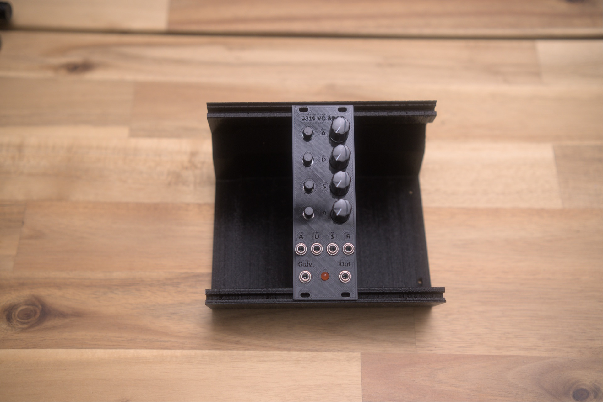

# Eurorack-3310-ADSR



A Eurorack ADSR envelope generator built around the [AS3310](https://electricdruid.net/product/as3310-vcadsr/) chip from Electric Druid — a precision voltage-controllable ADSR with a 100,000:1 time range, isolated control inputs, and a true exponential RC envelope shape. Each of Attack, Decay, Sustain, and Release has both a front-panel knob and a CV input with attenuator.

## Features

- **Full voltage-controlled ADSR** — A, D, S, R each have a panel pot *and* a CV input with attenuator
- **100,000:1 time range** (2 ms to 20 s per datasheet) via the AS3310's exponential time control
- **Independent gate and trigger** — internal differentiator generates a trigger pulse from the gate's rising edge, so the same gate jack restarts the envelope on each new note
- **Sustain CV** — 0 to +5V sets sustain level 0–100% of peak; Schottky clamp prevents over-spec
- **Output level / time-range trim (RV1)** — also acts as the AS3310 `Rx` reference resistor, see Design notes
- Eurorack ±12V power via either 16-pin IDC or 3-pin JST connector
- Local +5V regulated from +12V via KA78M05 for the AS3310's positive-supply needs
- LED envelope indicator (intensity tracks envelope output)

## Inputs and outputs

| Jack | Range | Notes |
|---|---|---|
| Attack CV In | 0 to ±5V | Sums with the Attack panel pot via summing amp U2A; attenuator RV2 (100K) sets CV depth |
| Decay CV In | 0 to ±5V | Sums with Decay panel pot via U2B; attenuator RV4 (100K) |
| Sustain CV In | 0 to ±5V | Sums with Sustain panel pot via U3A → U3B + BAT42 clamp to +5V; attenuator RV6 (100K) |
| Release CV In | 0 to ±5V | Sums with Release panel pot via U2C; attenuator RV8 (100K) |
| Gate In | 0/+5V (Eurorack) | Buffered through U2D unity follower; gate floor pulled to GND via R30 (10K) when unpatched |
| Env Out | 0 to ~+5V | Buffered through U3C unity follower with R26 (1K) series |

Front-panel pots:

| Pot | Value | Function |
|---|---|---|
| RV2 / RV4 / RV6 / RV8 | 100K each | Attack / Decay / Sustain / Release **CV attenuator** — sets depth of the corresponding CV jack |
| RV3 / RV5 / RV7 / RV9 | 10K each | Attack / Decay / Sustain / Release **panel level** — sets initial offset / manual A/D/S/R amount |
| RV1 (trim) | 20K | Output level / time-range trim, see Calibration |

## Block diagram

```
A CV ─►[RV2 atten]─┐
                   ▼
A panel pot ─►[RV3, +5V/GND]─►[U2A summing amp, -1×]─►[10K÷470Ω atten]─► AS3310 pin 15 VCA (Attack)

D CV ─►[RV4 atten]─┐
                   ▼
D panel pot ─►[RV5]──────────►[U2B summing amp, -1×]─►[10K÷470Ω atten]─► AS3310 pin 12 VCD (Decay)

S CV ─►[RV6 atten]─┐
                   ▼
S panel pot ─►[RV7]──────────►[U3A summing amp]─►[U3B + D1 BAT42 clamp→+5V]─►[1K]─► AS3310 pin 9 VCS (Sustain, 0 to +5V)

R CV ─►[RV8 atten]─┐
                   ▼
R panel pot ─►[RV9]──────────►[U2C summing amp, -1×]─►[10K÷470Ω atten]─► AS3310 pin 13 VCR (Release)

Gate jack ─►[R30 10K pulldown]─►[R24 100K]─►[U2D unity buffer]─┬─► AS3310 pin 4 GateIn
                                                                │
                                                                └─►[R25 10K + C8 2.7nF differentiator]─► AS3310 pin 5 TrigIn

AS3310 core:
  Pin 1  Cap     ── C1 47 nF ── GND                 (timing capacitor Cx)
  Pin 3  Vp      ── NC                              (Attack Peak Input; see Design notes)
  Pin 6  VEE−    ── R1 470 Ω ── −12V                (REE current limiter)
  Pin 7  PwrGND  ── GND
  Pin 8  Ccomp   ── C2 10 nF ── GND                 (compensation cap)
  Pin 10 Iin     ── R2 16K + RV1 (0–20K) ── pin 2 EnvOut  (Rx network; see Design notes)
  Pin 11 Vcc     ── +12V
  Pin 14 GND     ── GND
  Pin 16 AtkOut  ── NC

Pin 2 EnvOut ─►[RV1 wiper, also on Rx network]─►[U3C unity buffer]─►[R26 1K]─► Env Out jack
              │
              └─►[R28/R29 1 MΩ divider]─►[U3D buffer]─►[D2 LED]─►[R27 1K]─► GND
```

## Power

- Eurorack ±12V via **J7** (3-pin JST) or **J8** (16-pin IDC) — populate one
- D3 / D4: reverse-polarity protection diodes
- C9 / C14 (22 µF): bulk rail decoupling
- C12 / C13 (100 nF): op-amp supply decoupling near U2 / U3
- **U4 (KA78M05): +5V regulator** from +12V — supplies the chip's Vp pin reference and the Sustain clamp
- **R1 = 470 Ω — AS3310 VEE current limit resistor.** *Required* — the chip has an internal 7.4V Zener and must not see more than ~10 mA on the VEE pin.

REE formula from datasheet: **REE = (|VEE| − 7.5) / 0.010**

| VEE supply | REE |
|---|---|
| −9V | 150 Ω |
| −12V | 470 Ω ← *used here (actual calc 450 Ω, rounded up)* |
| −15V | 750 Ω |

## Calibration

This module has one trim (RV1, 20K) and eight front-panel pots. The eight pots are runtime controls, not calibration. Adjust RV1 with the module warmed up ~5 minutes.

**RV1 — output level / time-range trim.** RV1 sits on the AS3310's Rx reference network (between pin 10 Iin and pin 2 EnvOut), so it shifts the timing range as well as the output amplitude:

- Increasing RV1 resistance → longer maximum times, lower peak output
- Decreasing RV1 → shorter maximum times, higher peak output

Procedure:
1. Patch a stable +5V gate (e.g. a slow clock from another module) into Gate In and a scope on Env Out.
2. With all four CV attenuators (RV2 / RV4 / RV6 / RV8) fully clockwise and all four panel pots (RV3 / RV5 / RV7 / RV9) at 12 o'clock, you should see an envelope with moderate A/D/S/R values.
3. Adjust the **Attack panel pot (RV3)** through its range — attack time should sweep from fast (~2 ms) to slow (~20 s) per datasheet.
4. Repeat for Decay, Sustain, and Release. Sustain pot sets the held level (0 to ~+5V), not a time.
5. Adjust **RV1** to tune the envelope peak output to your preferred level. Note that this also shifts the time range — re-check the times if you change RV1 substantially.

## Design notes

A few choices in this design deviate from the AS3310 datasheet's canonical application circuit, kept here intentionally and confirmed working on a prototype:

- **Pin 3 Vp (Attack Peak Input) is left as NC.** The datasheet shows Vp tied to a +5V reference. With Vp floating, the chip uses its internal default. If you'd prefer a deterministic peak, tie pin 3 to the local +5V rail.
- **Iin (pin 10) reference is wired to EnvOut (pin 2) through R2 + RV1, not to +VCC.** The datasheet shows Rx connecting from +15V to pin 10. This design instead routes the reference through the envelope output node, which lets RV1 serve dual duty as output trim *and* time-range trim. The datasheet's `IpAmax = Vz/Rx` equation doesn't apply directly under this topology — empirically the chip generates working envelopes either way.
- **R2 = 16K** (formerly 10K in Rev 0.1.0, 30K is the datasheet's canonical Rx). With RV1 (0–20K) in series, effective Rx ranges 16K–36K.
- **CV input attenuator 10K + 470 Ω** maps 0 to −5V → 0 to −224 mV at the chip. Datasheet's spec range is 0 to −240 mV — this design is ~7% under-range, slightly clipping the long-time end.

## References

Local archived copies live in [`references/`](references/) so this repo stays useful if the upstream links die.

- **AS3310 datasheet** — [local copy](references/AS3310-alfatriode-2023-v7.pdf) · [upstream (alfatriode.lv)](https://alfatriode.lv/eng/sc/AS3310.pdf)
- **Electric Druid AS3310 product page** — [upstream](https://electricdruid.net/product/as3310-vcadsr/)
- **Design inspiration: Bumm Bumm Garage VCEG** — [upstream](https://www.bummbummgarage.com/modules/voltage-controlled-envelope-generator-vceg/) (page is JS/bot-protected; save manually if you want a local archive)

## Build status

What's ready for builders today, and what's still on the TODO list:

**Production assets** (what you need to actually fabricate and assemble a final unit)

- [x] Schematic — Rev 0.1.3 ([Eurorack-AS3310-ADSR-Schematic-Rev0.1.3.pdf](Schematic%20PDFs/Eurorack-AS3310-ADSR-Schematic-Rev0.1.3.pdf))
- [ ] PCB layout — in progress — single working layout in `kicad/`, not yet separated for fab
- [ ] Gerber files for fabrication — none yet
- [ ] BOM — none yet
- [ ] Final front panel (SVG/PDF for fab) — none yet
- [ ] License — none yet

**Prototype assets** (for breadboard / perfboard / 3D-printed-panel builds before final PCB)

- [x] 3D-printed prototype panel STL — [3310_ADSR.stl](3D%20printed%20front%20panel/3310_ADSR.stl)
- [x] Falstad simulations — [falstad/](falstad/)

**Documentation**

- [x] Photos of the assembled module — see [photos/](photos/)
- [ ] Demo video — none yet
- [ ] Build / assembly instructions — none yet

Want to help fill a gap (build photos, gerbers, an assembly guide)? Open an issue or PR.
